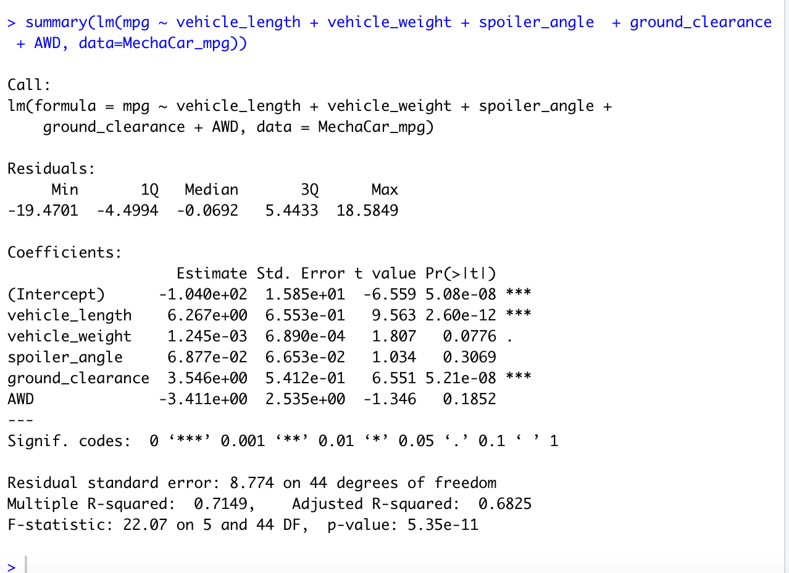
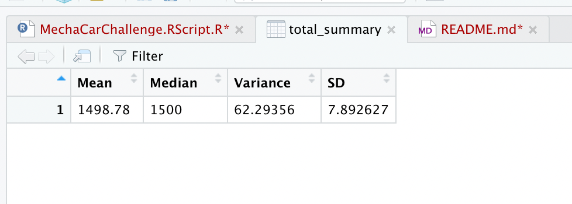
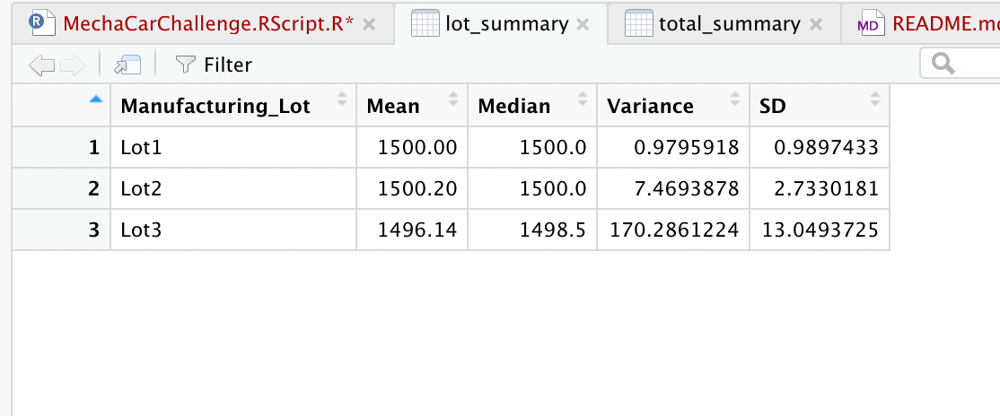
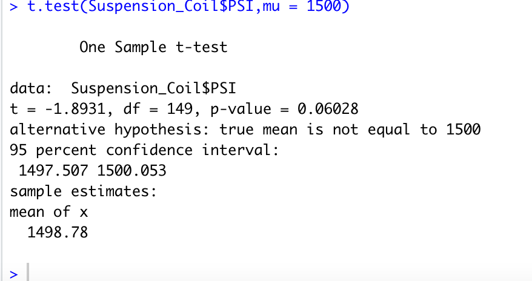
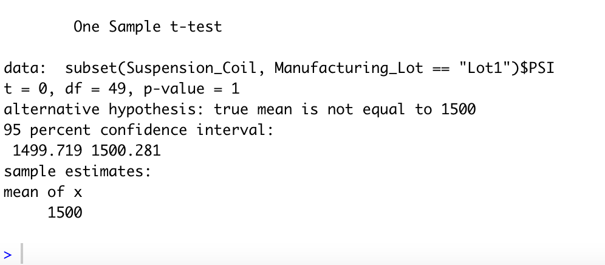
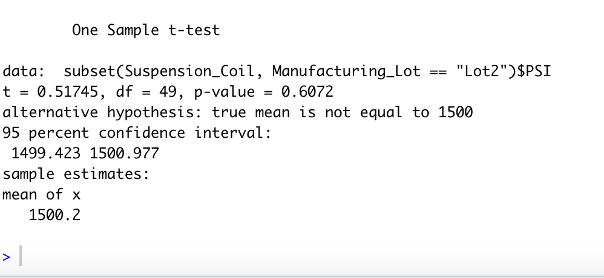
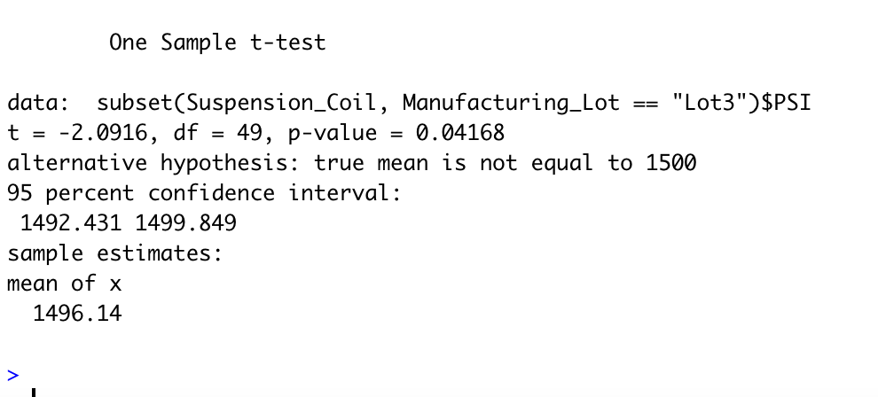

# MechaCar_Statistical_Analysis

## Linear Regression to Predict MPG

Vehicle length and ground clearance  provided a non-random amount of variance to the mpg values in the dataset.

The slope of the linear model is not  considered to be zero. 

This linear model predict mpg of MechaCar prototypes effectively, R-square is 0.71. 

## Summary Statistics on Suspension Coils

All manufacturing lots 

By each manufacturing lot

The design specifications for the MechaCar suspension coils dictate that the variance of the suspension coils must not exceed 100 pounds per square inch. The current manufacturing data meet this design specification for all manufacturing lots in total (62.29 pounds per square inch). For each lot individually - Lot 1 and Lot 2 meet this design specification  (0.98 and 7.5 pounds per square inch). Lot 3 didn't meet  specification (170.3 pounds per square inch).

## T-Tests on Suspension Coils

All manufacturing lots 

Lot 1

Lot 2

Lot 3

## Study Design: MechaCar vs Competition

To compare the MechaCar performs against the competition we will perform a statistical analysis based on cost, fuel efficiency, horse power, maintenance cost, safety rating. 
The null hypothesis would be  performance metrics is statistically similar between the MechaCar  and competitors vehicle.
To perform the test, we would need data of MechaCar vehicles and its competition.
